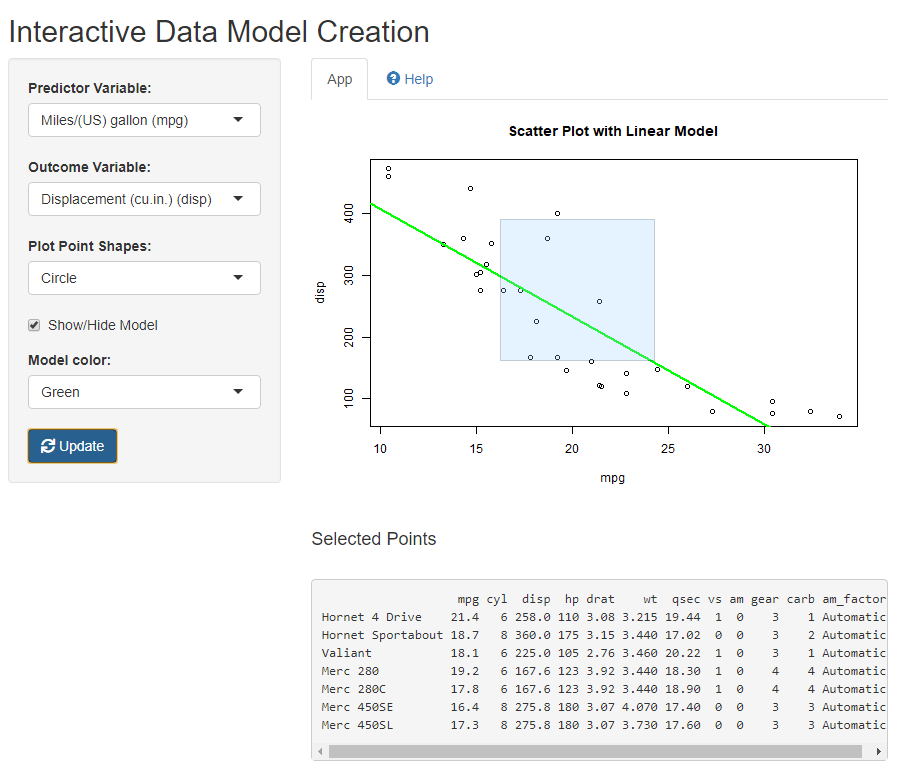

```{r setup, include=FALSE}
knitr::opts_chunk$set(echo = FALSE)
```

## Application Overview

This application is called **Interactive Data Model Creation** and has been build with **Shiny** in **RStudio**.

It helps the user visualise pairs of variables from the **mtcars** dataset into a scatter plot, as well as see the linear model, having one variable as predictor and the other as outcome.

The scatter plot introduces interactive brushing functionality, where the user can select data points and see the corresponding records from the original data set.

#### **The Shiny App can be found here:**
https://dionfragkoulis.shinyapps.io/shinyappdemo/

#### **The ui.R and server.R scripts are in github:**
https://github.com/dionfragkoulis/ShinyAppDemo


## DataSet Used
The data set that is being used is the **mtcars**:

```{r}
head(mtcars ,10)
```

## Sample Screen
{#id .class height=400px}


## Support

The application has embeded a **help** section, where ther user can find comprehensiveinformation about the usage of the app.

If you require additional support, you can contact me at:

**Email:** dfrag@hotmail.com

**Phone:** 0 7XXX XXX XXX